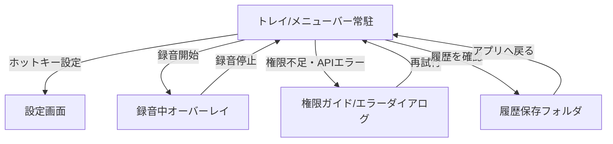

# サイトマップ（Phase 5）

更新日: 2026-02-07
対象: Desktop MVP（macOS / Windows / Linux）

## 画面一覧
1. トレイ/メニューバー常駐メニュー（ホーム）
2. 録音中オーバーレイ
3. 設定画面
4. 権限ガイド/エラーダイアログ
5. 履歴保存先オープン（外部フォルダ）

## 画面遷移図

## ナビゲーション方針
- 常にトレイ/メニューバーを起点にする（画面遷移を浅く保つ）
- 設定は1画面完結を基本とする
- エラー時は Fail Loud で即ダイアログ表示し、復帰導線を明示する
