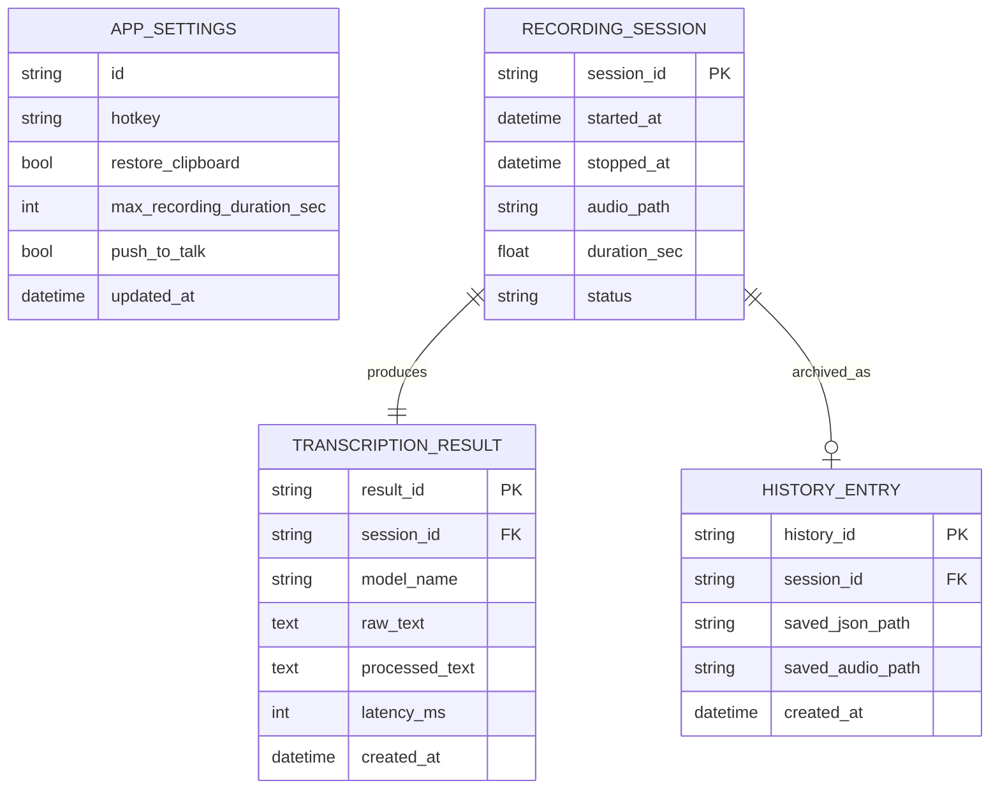

# データ設計（Phase 6）

更新日: 2026-02-07
前提: MVPではRDBを持たず、ローカルファイル（JSON/WAV）で管理する。

## エンティティ一覧
1. `AppSettings`
2. `RecordingSession`
3. `TranscriptionResult`
4. `HistoryEntry`

## エンティティ属性

### AppSettings
- `id` (string) 固定キー
- `hotkey` (string)
- `restore_clipboard` (bool)
- `max_recording_duration_sec` (int)
- `push_to_talk` (bool)
- `updated_at` (datetime)

### RecordingSession
- `session_id` (string)
- `started_at` (datetime)
- `stopped_at` (datetime)
- `audio_path` (string)
- `duration_sec` (float)
- `status` (enum: recording/success/failed)

### TranscriptionResult
- `result_id` (string)
- `session_id` (string, FK)
- `model_name` (string)
- `raw_text` (text)
- `processed_text` (text)
- `latency_ms` (int)
- `created_at` (datetime)

### HistoryEntry
- `history_id` (string)
- `session_id` (string, FK)
- `saved_json_path` (string)
- `saved_audio_path` (string)
- `created_at` (datetime)

## リレーション
- `RecordingSession` 1 - 1 `TranscriptionResult`
- `RecordingSession` 1 - 0..1 `HistoryEntry`
- `AppSettings` はグローバル単一レコード

## ER図

